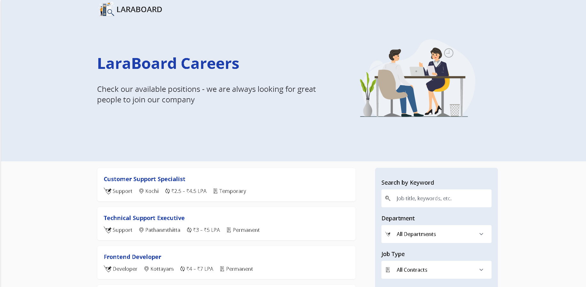
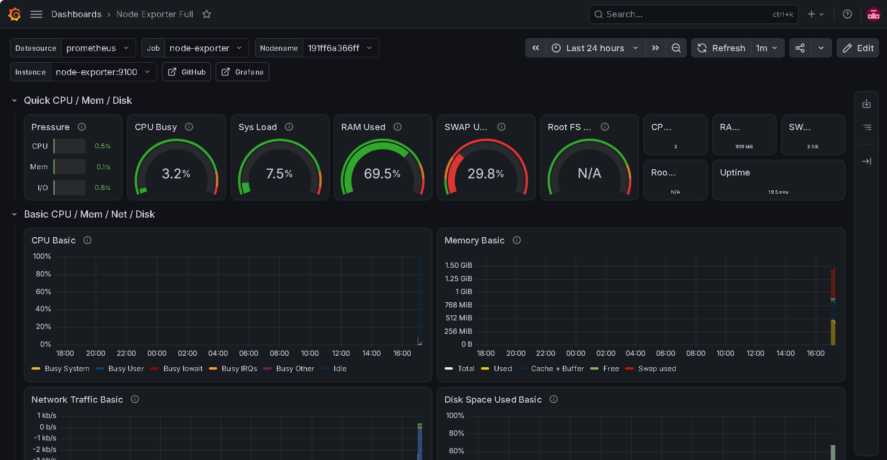
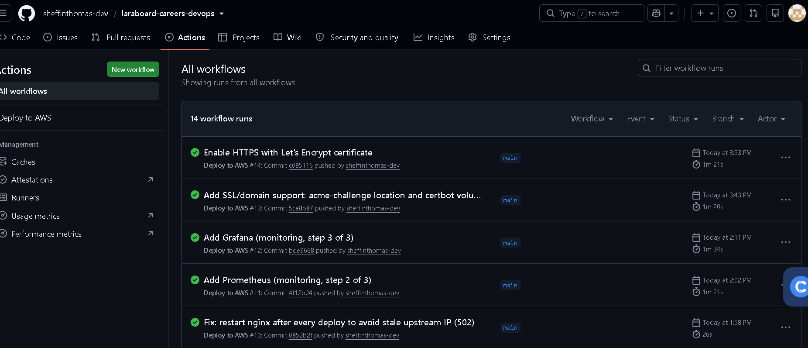
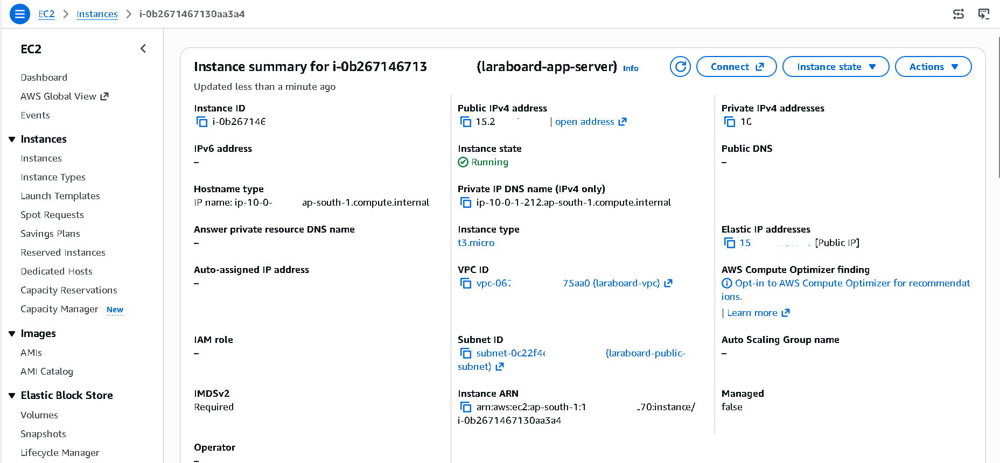
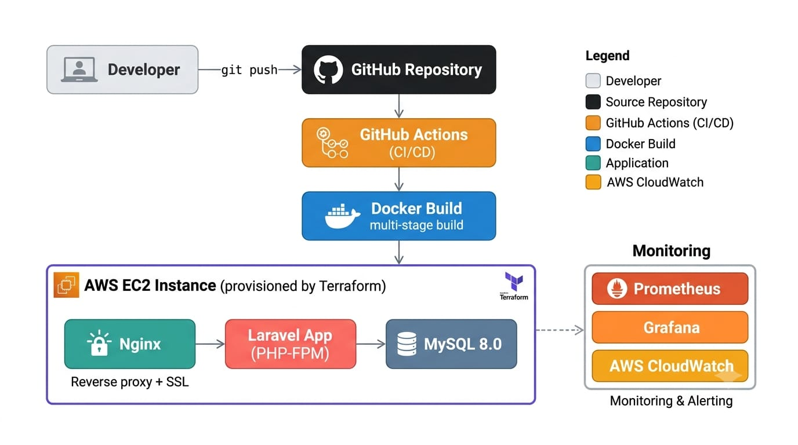

# LaraBoard Careers — Deployed on AWS with Docker, Terraform & CI/CD

A production-style deployment of an open-source Laravel job board application, containerized with Docker, provisioned on AWS EC2 entirely through Terraform, deployed automatically via GitHub Actions CI/CD, secured with HTTPS, and monitored with Prometheus and Grafana.

**Live site:** [https://laraboard.org](https://laraboard.org)

---

## About this project

The base application — job listings, applications, an admin dashboard — is an open-source Laravel job board ([originally by crivion](https://github.com/crivion/laraboard-careers), MIT licensed). **My work was the entire deployment and infrastructure layer**: containerization, cloud provisioning, automated deployment, HTTPS, and observability. I did not write the application's business logic; I built the systems that get it running reliably in production.

This project was built to demonstrate practical DevOps/Cloud Engineering skills: Docker, Infrastructure as Code, CI/CD pipelines, cloud networking, and monitoring — end to end, on real infrastructure, not a tutorial sandbox.

## Screenshots

<br>
*LaraBoard Careers running live on AWS EC2*

<br>
*Grafana dashboard showing live CPU, memory, and network metrics via Prometheus*

<br>
*Successful CI/CD run: build → deploy → health check*

<br>
*EC2 instance and networking provisioned entirely through Terraform — nothing clicked together manually*

## Architecture



All infrastructure — VPC, subnet, security groups, EC2 instance — is defined as code in `/infra` and provisioned with a single `terraform apply`. Nothing was clicked together manually in the AWS Console.

## Tech stack

| Layer | Tools |
|---|---|
| Application | Laravel 9, PHP 8.1, MySQL 8.0, Inertia.js/React |
| Containerization | Docker, multi-stage builds, Docker Compose |
| Infrastructure as Code | Terraform (AWS VPC, EC2, security groups) |
| CI/CD | GitHub Actions, automated build → deploy → health check |
| Web server / SSL | Nginx, Let's Encrypt (Certbot) |
| Monitoring | Prometheus, Grafana, node-exporter, AWS CloudWatch |
| Cloud | AWS EC2 (t3.micro), Elastic IP, custom domain (Namecheap) |

## Key engineering decisions

- **Multi-stage Docker builds** — frontend assets and Composer dependencies are built in isolated stages, keeping the final runtime image lean and free of build tooling.
- **Health-check-gated startup** — the app container won't start until MySQL passes an active health check, eliminating race-condition failures on cold starts.
- **Shared volume strategy for zero-downtime asset updates** — Nginx and the app container share a Docker volume for the `public/` directory, refreshed on every deploy without manual intervention.
- **Resource-aware tuning for a constrained instance** — MySQL's memory footprint is explicitly capped, and swap is configured, to run reliably within a `t3.micro`'s 1GB RAM.
- **Async job queue** — outbound email is processed via a background queue worker rather than inline during the request/response cycle, preventing slow SMTP calls from blocking user-facing requests.
- **Automated, retried deployments** — the GitHub Actions pipeline retries transient network/database-readiness failures automatically and runs a post-deploy health check before marking a release successful.

## Incidents & troubleshooting

Real production-style issues encountered and permanently resolved during this project:

**Docker build failures**
- *Problem:* Builds intermittently failed during dependency installation.
- *Root cause:* Layer caching picked up stale dependency state between builds.
- *Fix:* Restructured the Dockerfile so dependency-install layers only rebuild when the lockfile changes, and pinned base image versions to remove non-determinism.

**Database race condition on startup**
- *Problem:* The app container occasionally crashed on a fresh deploy because it tried to connect before MySQL was ready.
- *Root cause:* No dependency ordering between containers beyond Docker Compose's default (non-health-aware) startup order.
- *Fix:* Added an active health check to the MySQL container and gated the app container's startup on that check passing.

**Stale Nginx IP causing 502 errors**
- *Problem:* After redeploying the app container, Nginx intermittently returned 502 Bad Gateway.
- *Root cause:* Nginx resolves the app container's IP once at startup and caches it; a redeployed container gets a new internal IP that Nginx doesn't pick up.
- *Fix:* Configured Nginx to use Docker's internal DNS resolver with a short TTL so it re-resolves the app container's address instead of caching it indefinitely.

**Kernel OOM-killed MySQL process**
- *Problem:* MySQL was unexpectedly killed under memory pressure on the `t3.micro` instance.
- *Root cause:* The Linux kernel's OOM killer terminated MySQL when total memory usage exceeded available RAM, with no swap configured as a buffer.
- *Fix:* Configured a swap file and tuned MySQL's memory settings (buffer pool size, connection limits) to fit safely within the instance's 1GB RAM.

**CI/CD pipeline reliability**
- *Problem:* Deploys occasionally failed due to transient SSH or network issues, requiring manual re-runs.
- *Root cause:* No retry logic — a single transient failure failed the whole pipeline.
- *Fix:* Added automatic retries for network- and readiness-related steps, plus a post-deploy health check that must pass before a release is marked successful.

## CI/CD pipeline

Every push to `main` triggers an automated pipeline that:
1. Connects to the EC2 instance over SSH
2. Pulls the latest code
3. Rebuilds and restarts the Docker containers
4. Runs database migrations
5. Verifies the site responds successfully before completing

## Monitoring

- **Grafana** dashboards visualize live CPU, memory, disk, and network metrics collected by **Prometheus** and **node-exporter**.
- **AWS CloudWatch** provides infrastructure-level alerting (CPU thresholds) independent of the application stack.

## Local development

```bash
git clone https://github.com/sheffinthomas-dev/laraboard-careers-devops.git
cd laraboard-careers-devops
cp .env.example .env
docker compose up -d --build
docker compose exec app php artisan key:generate
docker compose exec app php artisan migrate
docker compose exec app php artisan storage:link
```

Visit `http://localhost` once containers are running.

## Attribution & license

Base application: [crivion/laraboard-careers](https://github.com/crivion/laraboard-careers), MIT License. Infrastructure, deployment, and DevOps tooling in this repository are original work.

## Author

**Sheffin Thomas** — [LinkedIn](https://www.linkedin.com/in/sheffin-thomas/) · [GitHub](https://github.com/sheffinthomas-dev)
